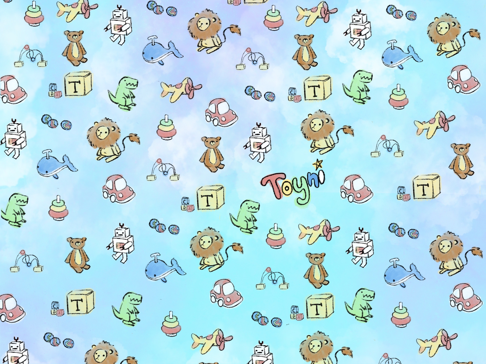

# Toyni: A STARK Implementation in Progress

> [!WARNING]
> This research implementation of a STARK proving system
> is not yet secure and under heavy development.
> Do not use this in production or your will CERTAINLY get compromized.
> No audits, no guarantees provided, use at own risk.

Welcome to Toyni! This is an implementation of a STARK (Scalable Transparent Argument of Knowledge) proving system in Rust. While it's not yet a full zero-knowledge STARK, it provides a solid foundation for understanding how STARKs work.





Meet the amazing artist behind this creation, [Kristiana Skrastina](https://www.linkedin.com/in/kristiana-skrastina/)

## Introduction

STARKs are a powerful cryptographic tool that enables proving the correct execution of a computation without revealing the underlying data. Think of it as a way to convince someone that you know the solution to a puzzle without actually showing them the solution. This property, known as zero-knowledge, is crucial for privacy-preserving applications in areas like financial transactions, voting systems, and private identity verification.

### Why STARKs Matter

| Scalability | Transparency | Zero-Knowledge |
|-------------|--------------|----------------|
| • O(log² n) proof size | • No trusted setup | • Privacy |
| • Fast verify | • Public parameters | • Confidentiality |
| • Efficient | | • Data protection |
| | | • Secure sharing |

### Real-World Applications

| Financial | Identity | Computing |
|-----------|----------|-----------|
| • Private payments | • Age verification | • Confidential computing |
| • Asset ownership | • Credential validation | • Private ML |
| | | • Secure MPC |

## Technical Overview

At its heart, Toyni consists of three main components working together:

| Virtual Machine | Constraint System | STARK Prover |
|----------------|-------------------|--------------|
| • Executes programs | • Defines rules | • Generates proofs |
| • Creates traces | • Validates states | • Uses FRI protocol |

### How It Works

| Program Execution | Execution Trace | Verification |
|------------------|-----------------|--------------|
| • Run program | • Record states | • Sample positions |
| • Track state | • Build constraints | • Check constraints |
| • Generate trace | | |

Here's a simple example that demonstrates how Toyni works. We'll create a program that proves a sequence of numbers increments by 1 each time:

```rust
// Create a trace of 4 states, each with one variable 'x'
let mut trace = ExecutionTrace::new(4, 1);
for i in 0..4 {
    let mut column = HashMap::new();
    column.insert("x".to_string(), i);
    trace.insert_column(column);
}

// Define the constraints
let mut constraints = ConstraintSystem::new();

// Transition constraint: x[n+1] = x[n] + 1
constraints.add_transition_constraint(
    "increment".to_string(),
    vec!["x".to_string()],
    Box::new(|current, next| {
        let x_current = current.get("x").unwrap();
        let x_next = next.get("x").unwrap();
        Fr::from(*x_next as u64) - Fr::from(*x_current as u64 + 1)
    }),
);

// Boundary constraint: x[0] = 0
constraints.add_boundary_constraint(
    "start".to_string(),
    0,
    vec!["x".to_string()],
    Box::new(|row| Fr::from(*row.get("x").unwrap() as u64)),
);

// Generate and verify the proof
let blowup = 8;
let proof = StarkProof::new(&trace, &constraints, blowup);
assert!(proof.verify(&trace, &constraints, blowup));
```

This example demonstrates how Toyni can prove that a sequence of numbers follows a specific pattern (incrementing by 1) without revealing the actual numbers. The proof can be verified by anyone, but the actual values remain private.

### Security Properties

STARKs achieve their security through a combination of domain extension and low-degree testing. Here's how it works:

| Domain Extension | Low-Degree Testing | Soundness Guarantees |
|-----------------|-------------------|---------------------|
| • Extend domain | • FRI protocol | • Soundness error: (1/b)^q |
| • Blowup factor | • Polynomial degree | • Query complexity |

The security of a STARK proof relies on two key mechanisms:

1. **Domain Extension (Blowup)**: The composition polynomial is evaluated over a domain that's `b` times larger than the original trace length, where `b` is the blowup factor.

2. **Low-Degree Testing**: The FRI protocol ensures that the polynomial being tested is close to a valid low-degree polynomial.

The soundness error (probability of accepting an invalid proof) is bounded by:

```
Pr[undetected cheat] = (1/b)^q
```

where:
- `b` is the blowup factor (e.g., 8 in our example)
- `q` is the number of queries made by the verifier

This means that if a prover tries to cheat by modifying a fraction 1/b of the domain, the verifier will detect this with probability at least 1 - (1/b)^q. For example, with a blowup factor of 8 and 10 queries, the soundness error is at most (1/8)^10 ≈ 0.0000001.

## Project Structure

The codebase is organized into logical components:

| Math | VM | Library |
|------|----|---------|
| • Polynomial | • Constraints | • Entry point |
| • Domain | • Trace | • Public API |
| • FRI | • Execution | • Documentation |
| • STARK | | |

## Current Status

### Current Features

| Constraint System | FRI Protocol | Mathematical Operations |
|------------------|--------------|------------------------|
| • Transition constraints | • Low-degree testing | • Polynomial arithmetic |
| • Boundary constraints | • Interactive verification | • Field operations |
| • Quotient verification | • FRI folding layers | • Domain operations |

### Missing Components

| Zero-Knowledge | Merkle Commitments | Fiat-Shamir Transform |
|----------------|-------------------|----------------------|
| • Trace privacy | • Tree structure | • Deterministic hashing |
| • State protection | • Proof generation | • Non-interactive |

While we have a working STARK implementation with quotient polynomial verification, it's not yet a full zero-knowledge system. The main limitations are:

1. The execution trace is currently exposed to the verifier, revealing all program variables and states.
2. We're using random number generation instead of the Fiat-Shamir transform, making the protocol interactive.
3. The proof system lacks Merkle commitments for the FRI layers, which are essential for zero-knowledge properties.

To achieve full zero-knowledge capabilities, we need to:
- Implement Merkle tree commitments for the FRI layers
- Replace random number generation with deterministic hashing (Fiat-Shamir transform)
- Add trace blinding and random masks to the composition polynomial
- Optimize the proof generation and verification process

### Next Steps

1. **Merkle Commitments**
   - Implement Merkle tree structure for FRI layers
   - Add commitment verification in the FRI protocol
   - Optimize commitment size and verification time

2. **Fiat-Shamir Transform**
   - Replace random number generation with deterministic hashing
   - Implement transcript-based challenge generation
   - Ensure security properties of the transform

3. **Constraint System Improvements**
   - Add higher-level abstractions for constraint definition
   - Implement more complex constraint types
   - Optimize constraint evaluation

4. **Zero-Knowledge Properties**
   - Add trace blinding
   - Implement random masks for the composition polynomial
   - Ensure privacy of witness data

## Contributing

We welcome contributions to Toyni! Our current focus is on implementing zero-knowledge properties and improving the overall system. We're particularly interested in:

1. Implementing Merkle tree commitments and the Fiat-Shamir transform
2. Adding comprehensive test coverage and security audits
3. Improving documentation and adding more examples
4. Optimizing performance and reducing proof sizes

# Associated With

<div align="center">

| <a href="https://timewave.computer/"></a> | <a href="https://ciphercurve.com"></a> |
|:---:|:---:|
| [Timwave Computer](https://timewave.computer/) | [Ciphercurve](https://ciphercurve.com) |

</div>

---

<div align="center">
  <h3>2025 Ciphercurve, Timewave Computer</h3>
  <p><em>Building the future of privacy-preserving computation</em></p>
</div>


